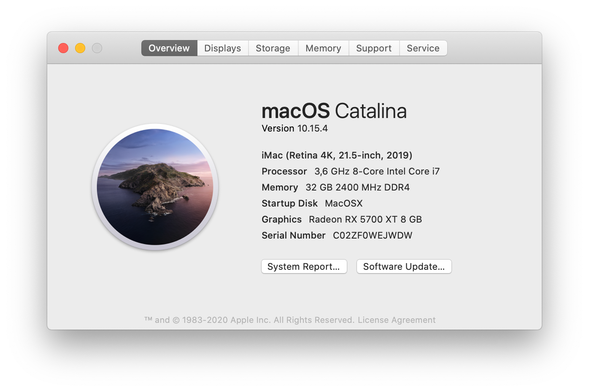

# OpenCore Hackintosh Catalina For Asus ROG Strix Z390-H Gaming Motherboard
This is a vanilla setup with [OpenCore](https://github.com/acidanthera/OpenCorePkg "OpenCore") as boot loader. I have used [this guide](https://dortania.github.io/OpenCore-Install-Guide/ "OpenCore Desktop Guide") for creating and configuring the `EFI` folder, and will try to keep up to date with new OpenCore and MacOS releases for this is my daily drive.

## Hardware 

| Component   | Model/Brand                         | Notes                                                                                                                                                                                  |
|-------------|-------------------------------------|----------------------------------------------------------------------------------------------------------------------------------------------------------------------------------------|
| CPU         | Intel Core i7 9700K                 | Any required configurations is present in the `EFI`                                                                                                                                    |
| Motherboard | Asus ROG Strix Z390-H Gaming        | You need to apply [these BIOS settings](https://dortania.github.io/OpenCore-Install-Guide/config.plist/coffee-lake.html#intel-bios-settings)                                           |
| RAM         | Kingston 16GB 2400MHZ DDR4          | Two sticks, totaling to 32 GB                                                                                                                                                          |
| GPU         | Sapphire Pulse AMD Radeon RX 5700XT | With `WhateverGreen` kext and `agdpmod=pikera` parameter. (Already configured)                                                                                                         |
| Bluetooth   | Trust 18187 Bluetooth 4.0 Adaptor   | Dongle, works out of the box                                                                                                                                                           |
| SMBIOS      | iMac19,2                            | While provided serial works, you may want to generate your own.   Refer to this [guide](https://dortania.github.io/OpenCore-Install-Guide/config.plist/coffee-lake.html#platforminfo). |

---
**NOTE**

If you wish to have wi-fi functionality you should purchase a `Broadcom BCM94360NG` card and plug it in. No other configurations are needed.

---

## What works

- :white_check_mark: Sleep/Wake
- :white_check_mark: Ethernet
- :white_check_mark: Bluetooth
- :white_check_mark: USB ports
- :white_check_mark: Audio
- :white_check_mark: CPU power management